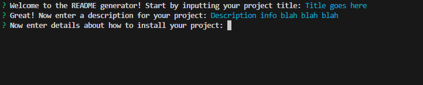
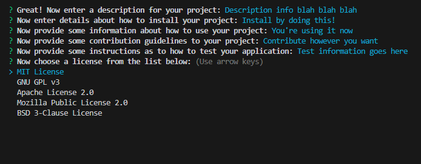
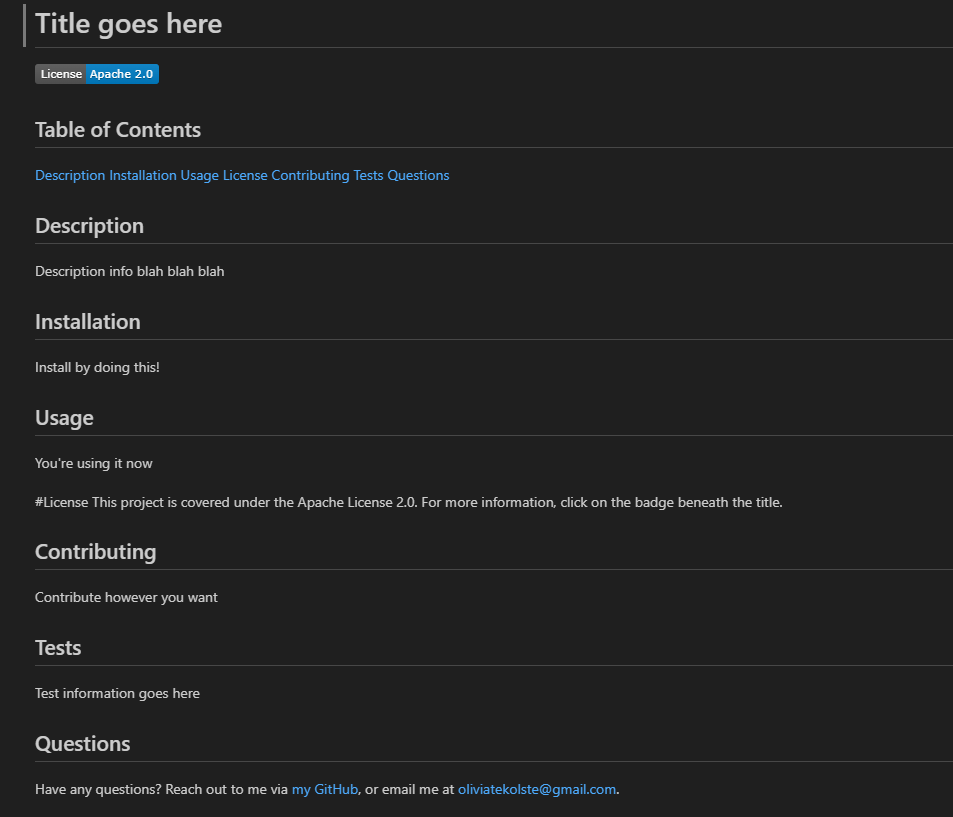

# README Generator

## Description

This project generates a properly-formatted ReadMe! Creating a ReadMe can be a tedious task to even the most skilled programmers; as such, this application aims to cut down on the time it takes to produce a high-quality, well-formatted document that contains all the information you need to publish your code on the Internet. In creating this, I also got the chance to work with NPM - specifically, the inquirer and FS packages. I combined these functions using JavaScript to walk an user through creating a README, then parse that data and generate a markdown file that displays it all.

## Installation 

Before you begin, make sure you have Node installed. You can download this as a ZIP file from GitHub (click the green <>Code button in the upper right on the repository page, then click Download Zip). Once you've extracted the files, open them in your IDE of choice. You'll need to make sure you install the Inquirer package via NPM by running "npm install" in a terminal in the directory you've just created. Then, just run "node index" in that same directory and answer the questions! 

## Usage 
To start, run the program. You will be walked through the different important sections of the README - just type your answers in in response to the questions! 

For the license portion, select one of the licenses listed by using the arrow keys. (I chose to include the most common licenses.) 

Then, check out the file that gets generated called "generatedREADME.md"!

[Check out a video walkthrough here!](https://drive.google.com/file/d/1Qz7R9VaFstT_FYLEoZUJdbgqJHjLhHLC/view?usp=sharing)

## Credits
This project makes use of the [Inquirer package](https://www.npmjs.com/package/inquirer).

## License

This project is covered by the MIT License. For more information, click on the badge at the top of the README.
